# Chat Application

[Link to the backend side](https://github.com/bojkovladislav/Chat-Application-Server)

## [DEMO LINK](chat-application-sable-nine.vercel.app)

## Navigation:
- #### [Overview](#overview)
- #### [Used Technologies](#used-technologies)
- #### [Log in](#log-in)
- #### [Private Rooms](#private-rooms)
- #### [Group Chats](#group-chats)
- #### [Chat Functionality](#chat-functionality)

### Welcome to the Chat Application Documentation!

- **Welcome Screen**: A user-friendly login form greets users, offering seamless access to the application.
- **Private Rooms**: Initiate private conversations with ease, with the ability to add friends and delete rooms.
- **Group Chats**: Connect with multiple users simultaneously through customizable group chats.
- **Chat Functionality**: Engage in dynamic conversations with features like messaging, replying, copying, editing, and emoji support.
- **Responsiveness**: The application is fully responsive, ensuring a smooth user experience across various devices.

## [Used Technologies](#used-technologies)

- React
- Tailwind
- Zustand
- Socket.io Client
- Axios
- Mantine UI
- React Bootstrap Icons
- Vite
- UUID
- lodash

## [Log in](#log-in)

### Introduction

New users can create an account by clicking the "Log in" button. Existing users will be logged into their account upon clicking.

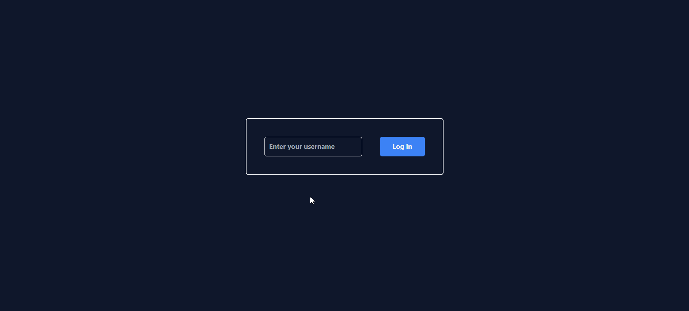

## [Private Rooms](#private-rooms)

### Introduction

Private Rooms allow users to engage in one-on-one conversations in a secure environment.

### Features

1. **Adding Friends**: Utilize the search bar to find friends and add them to your private rooms.
   
   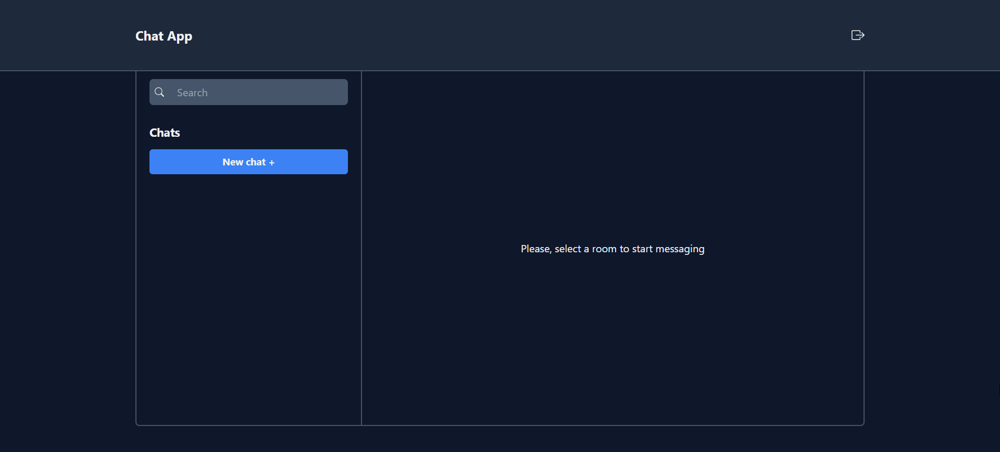
   
2. **Room Management**: Room creators have the ability to delete rooms as needed.
   
   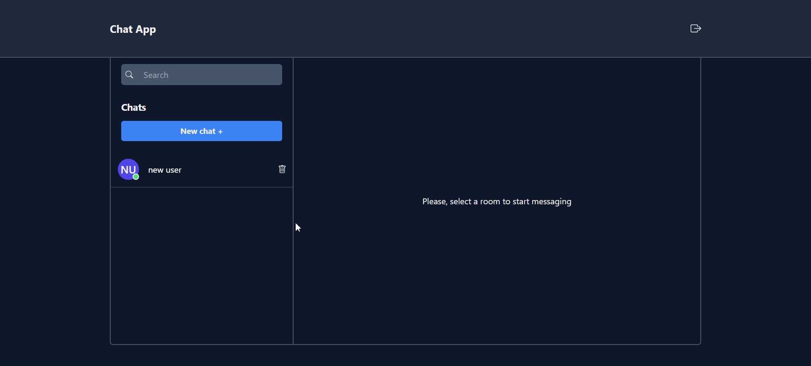
   
3. **Room Settings**:
   - View Room Info: Check the room's information.
     
     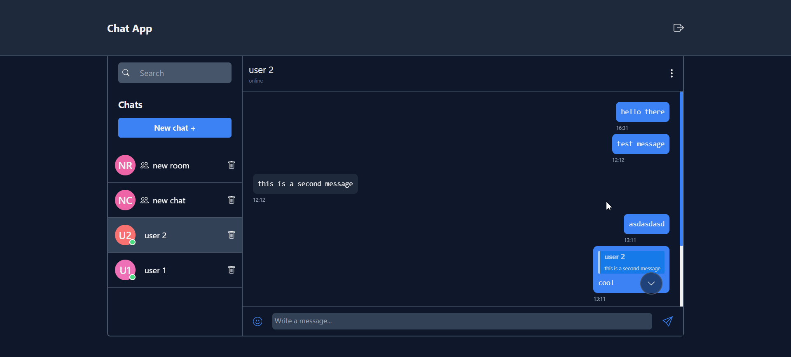
     
   - Delete Room: Delete a room for yourself by clicking the option.

     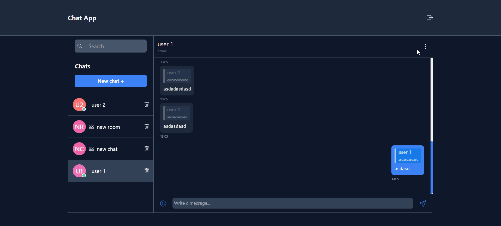

### Deletion Behavior

- Deleting a chat will remove it only for the user who initiated the deletion.
- If the other participant sends a message, the chat will be restored.
- If both users delete the chat, all message history will be permanently removed.

## [Group Chats](#group-chats)

### Introduction

Group Chats facilitate communication among multiple users in a collaborative setting.

### Features

1. **Creation**: Access the main menu and select "new chat +" to create a group chat. Customize group chat settings according to your preferences.
   
   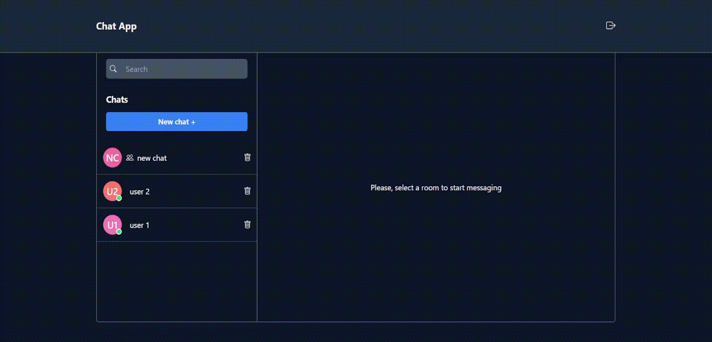
   
2. **Group Settings**:

- View Group Info: See the main information of the group.
  
  

- Delete Group:
  - Delete for self: Non-creators can delete a group for themselves only.
  - 
    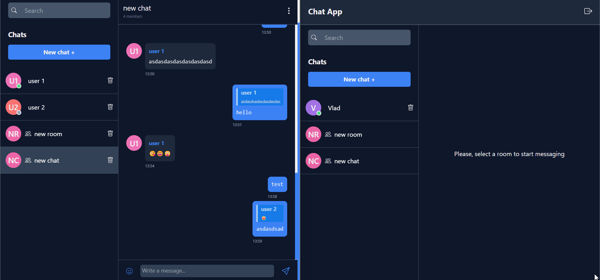
    
  - Delete for everyone: Creators can delete a group for everyone.
  - 
    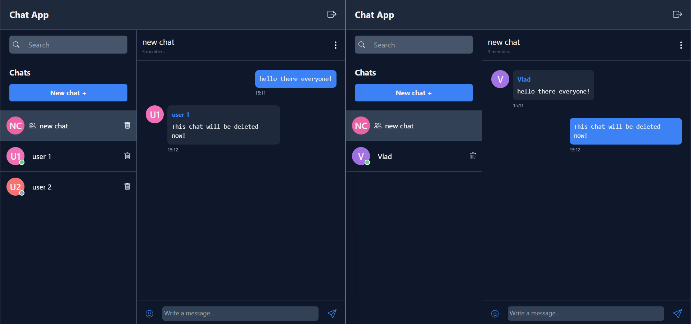

## [Chat Functionality](#chat-functionality)

### Introduction

Explore various features available within the chat interface.

### Features

- **Messaging**: Send and receive messages in real-time.
  
  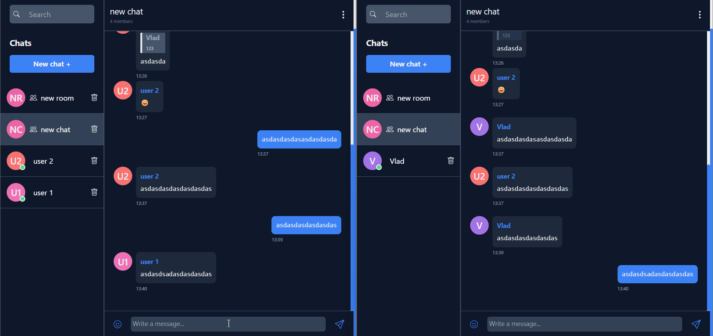
  
- **Replying**: Respond directly to specific messages for clarity.
  
  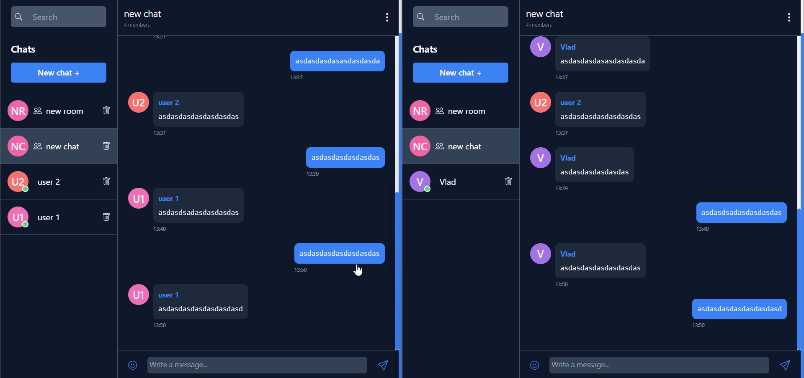

- **Copying**: Copy messages to the clipboard.
  
  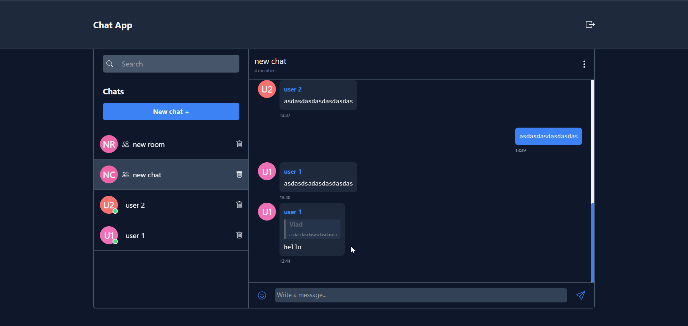

- **Editing**: Modify sent messages to correct errors or update information.
  
  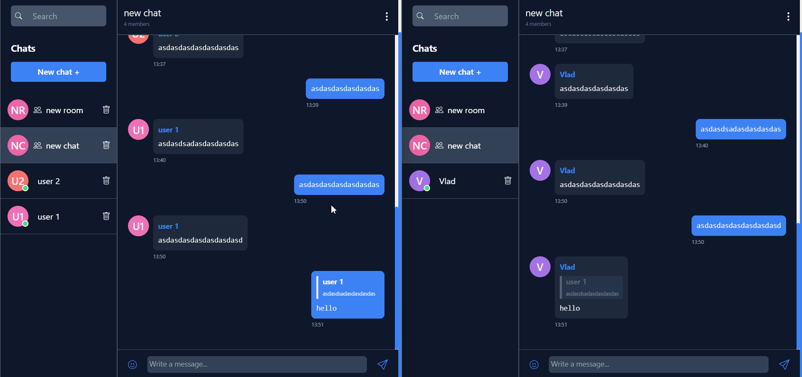

- **Emoji Support**: Enhance expressions with a diverse range of emoticons using the integrated emoji API.
  
  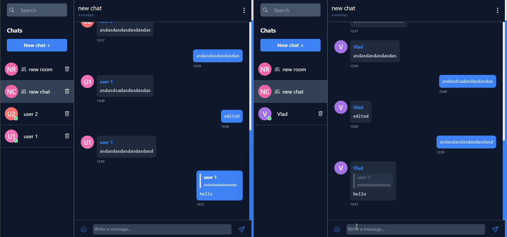

- **Scroll To The Bottom Button**: Easily navigate to the bottom of the chat with the "go to the bottom" button.
  
  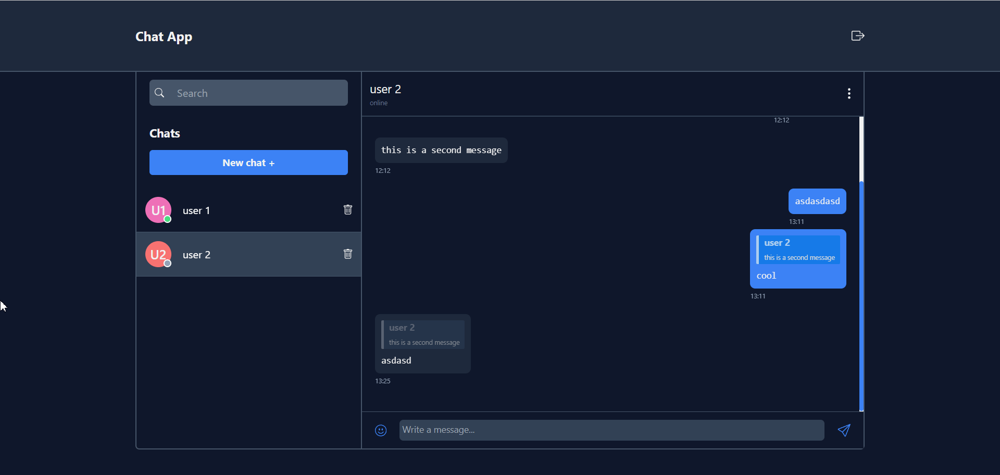

- **Scroll To Latest Messages**: Quickly scroll to the latest message with the new message notification button.
  
  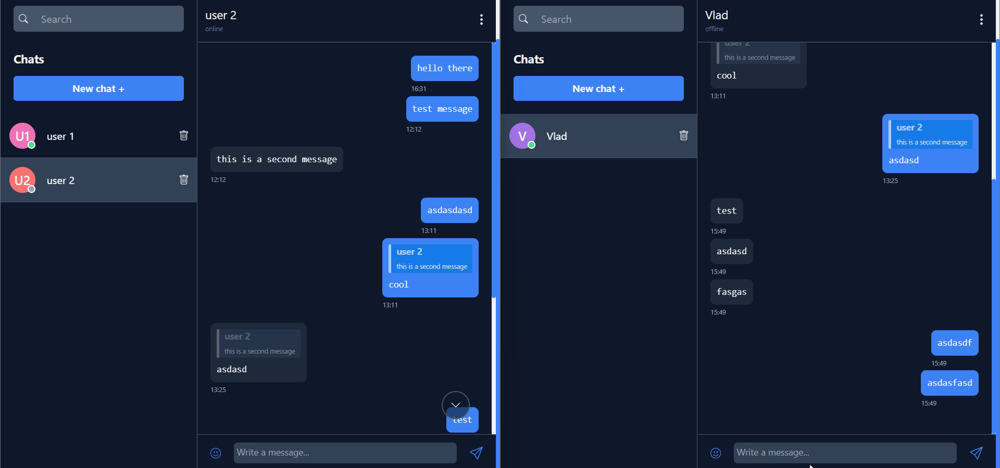

[Back to Top](#Chat-Application)
